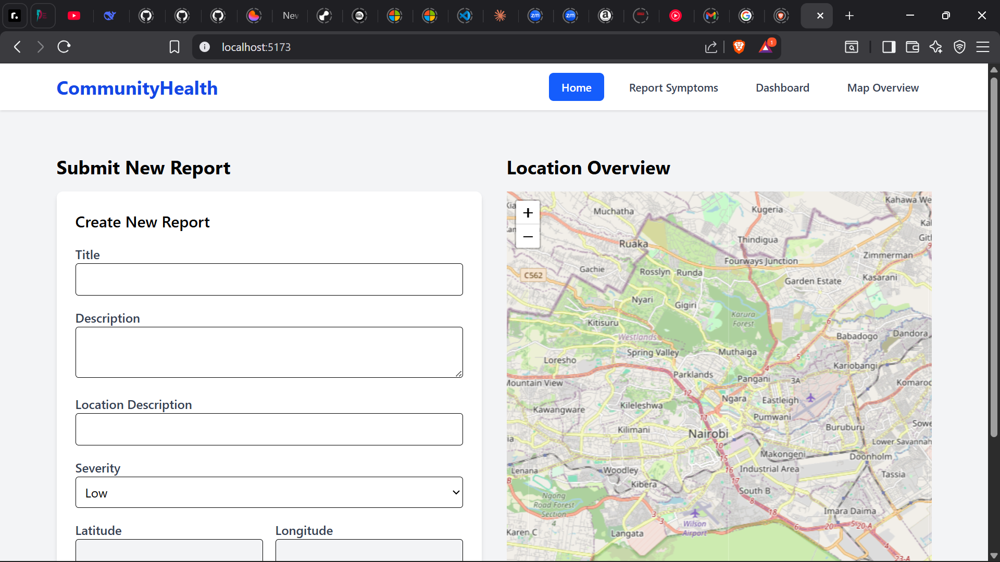

 📘 Community Health Reporting System

A full-stack web application that allows community members to report health-related issues, view them on an interactive map, and track severity levels.

This project uses:

Frontend: React + Vite + TailwindCSS + Leaflet

Backend: Node.js + Express + MongoDB

Map: Leaflet JS

Other: Axios, React Router

🚀 Features
✅ 1. Submit Health Reports

Users can report symptoms, health issues, or incidents with:

Title

Description

Location text

Severity level (Low / Medium / High)

Automatically captured map coordinates

✅ 2. Interactive Map

Click on the map to auto-fill coordinates in the form

View all existing reports on a Leaflet map

Click a report to focus the map on that position

✅ 3. Pagination & Filtering

Reports are loaded 5 at a time

“Previous” / “Next” buttons

Filter reports by severity

✅ 4. Report Details Page

Each report has a unique page (/report/:id) showing:

Full details

Map view for that individual report

🛠️ Tech Stack
Frontend

React (hooks)

React Router

Axios

Leaflet

TailwindCSS

Backend

Express.js

Mongoose (MongoDB)

CORS

dotenv

📂 Project Structure
project/
│
├── client/
│   ├── src/
│   │   ├── components/
│   │   │   ├── MapView.jsx
│   │   │   └── ReportForm.jsx
│   │   ├── pages/
│   │   │   ├── Reports.jsx
│   │   │   └── ReportDetails.jsx
│   │   ├── App.jsx
│   │   ├── main.jsx
│   │   ├── index.css
│   │   └── api.js (optional)
│   └── package.json
│
├── server/
│   ├── routes/
│   │   └── reportRoutes.js
│   ├── models/
│   │   └── Report.js
│   ├── server.js
│   ├── .env
│   └── package.json
│
└── README.md

💻 Installation & Setup
1️⃣ Clone the repository
git clone https://github.com/yourusername/community-health-reporting-system.git
cd community-health-reporting-system

2️⃣ Install Backend Dependencies
cd server
npm install

3️⃣ Create Backend Environment Variables

Create a .env file inside server/:

MONGO_URI=your_mongodb_connection_string
PORT=5000

4️⃣ Run Backend
npm start

You should see:

Server running on port 5000
MongoDB connected

5️⃣ Install Frontend Dependencies
cd ../client
npm install

6️⃣ Run Frontend
npm run dev

Open:

http://localhost:5173

🌍 Environment Setup (Frontend)

Create:

client/.env

Add:

VITE_API_BASE=http://localhost:5000

📌 API Endpoints
GET /api/reports

Fetch paginated reports:

/api/reports?limit=5&skip=0

GET /api/reports/:id

Fetch a single report.

POST /api/reports

Create a new health report.

Body example:

{
  "title": "Flu outbreak",
  "description": "People coughing in the area",
  "locationText": "Kawangware",
  "severity": "High",
  "coords": { "lat": -1.284, "lng": 36.817 }
}

🧪 Testing

You can test API endpoints using:

Postman

Thunder Client

Browser

Axios requests from React

📸 Screenshots 

Homepage[]

project kink

<>

🏁 Final Notes

This project is:

Beginner-friendly

Fully functional

Clean architecture

Perfect for a portfolio or school submission